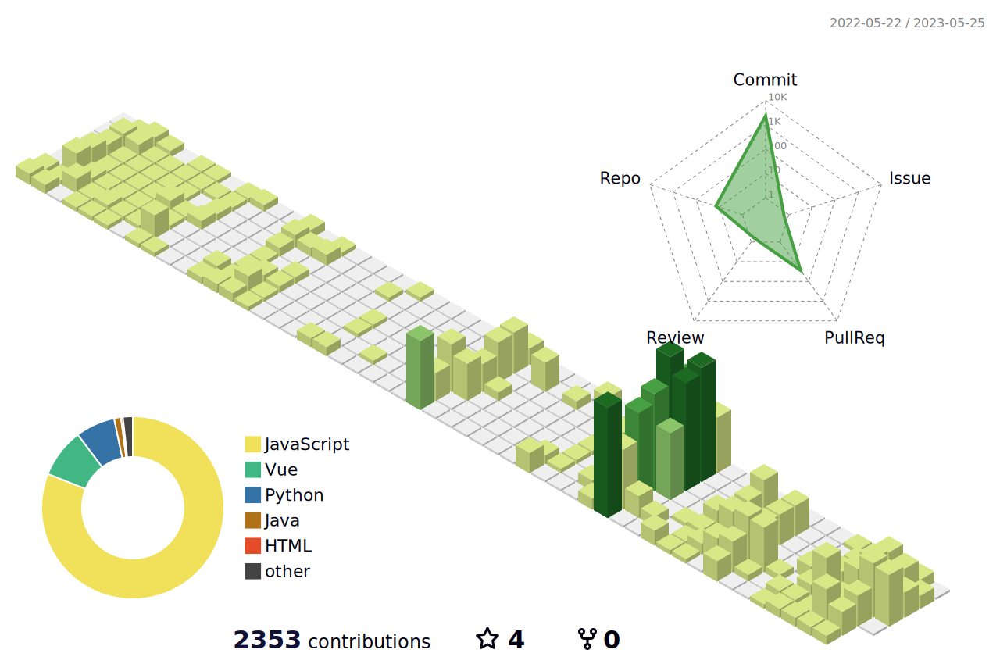

<!-- font-size 를 조절하면 원하는 크기로 글자를 조절할 수 있습니다.-->
  <!-- Designed and developed in-house at Oreuda (https://oreuda.kr) -->
  <!-- 불편 사항 및 문의는 tykimdream@gmail.com으로 보내주세요 -->
  

    
    
    
  

  
  
  
  

    
  

  
  

  <h3 style ="font-size : 2em; font-weight:700;">🍀Tech Stack🍀</h3>
    
 
   
   
   
  
   
   
   
   
  
   
  
   
  
   
   
   
  
   
    
  
   

   
   
  
       
   
  
  
  
   

  

  
  

    <h3 style ="font-size : 2em; font-weight:700;">💙Contact💙</h3>
    

      
      
      
    

  

  
  

    
  

  
  

    

          <h3 style ="font-size : 1.5em; font-weight:700;">
          이력
          </h3>
          
1. 이력1
2. 이력2
3. 이력3

    

  

  
  

    

          <h3 style ="font-size : 1.5em; font-weight:700;">
          이력2
          </h3>
          
1.이력1
2.이력2

    

  

  

